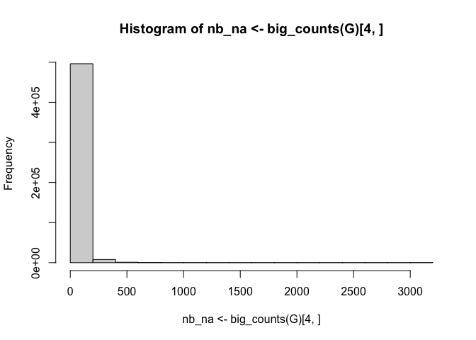
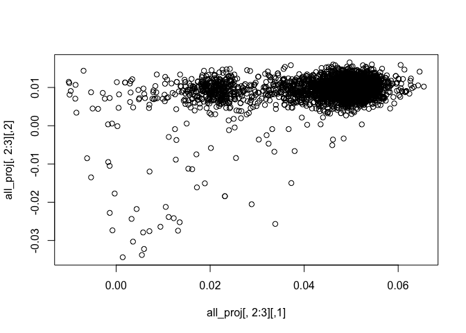
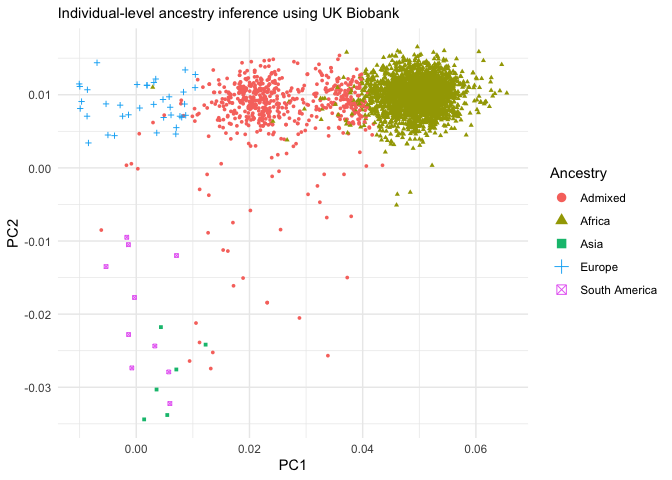
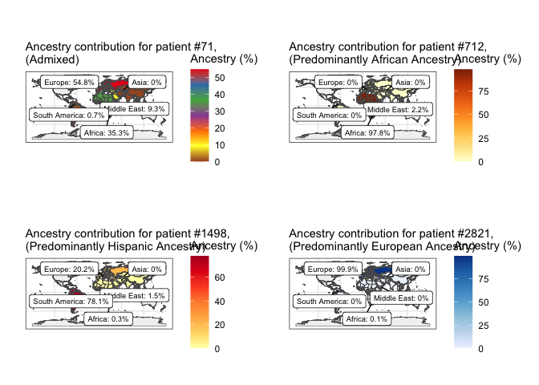

# 1 Introduction

This tutorial is intended to estimate genetic ancestry using R. It is a
code reproduction of Prive et al., “Using the UK Biobank as a global
reference of worldwide populations: application to measuring ancestry
diversity from GWAS summary statistics.” Bioinformatics (2022). Compared
to other ancestry tools (e.g., RFmix), this is a programming-driven
approach that uses only R and the bigsnpr package. There is not better
between the former and the latter, however, this is a good option for
those more versed in programming languages.

First some basics on PCA:
[](https://youtu.be/fkf4IBRSeEc)

# 2 Estimating ancestry proportions from allele frequencies only

You’ll learn:

-   How to estimate ancestry proportions from GWAS summary statistics
    (using only allele frequencies).

``` r
# /!\ This downloads 160 Mb
gz <- runonce::download_file(
  "http://www.epigad.org/gwas_ilae2018_16loci/all_epilepsy_METAL.gz",
  dir = "ancestry_datasets/")
readLines(gz, n = 3)
```

    ## [1] "CHR\tBP\tMarkerName\tAllele1\tAllele2\tFreq1\tFreqSE\tWeight\tZscore\tP-value\tDirection\tHetISq\tHetChiSq\tHetDf\tHetPVal"
    ## [2] "6\t130840091\trs2326918\ta\tg\t0.8470\t0.0178\t36306.88\t-0.279\t0.7805\t-+?\t0.0\t0.117\t1\t0.7321"                       
    ## [3] "7\t145771806\trs6977693\tt\tc\t0.8587\t0.0117\t35731.15\t-0.874\t0.3823\t-+?\t0.0\t0.304\t1\t0.5815"

``` r
target<-fread("ancestry_datasets/all_epilepsy_METAL")%>% 
  dplyr::select(CHR,BP,Allele2,Allele1,Freq1,MarkerName) %>% 
  mutate_at(3:4,toupper)
colnames(target)<- c("chr", "pos", "a0", "a1", "freq","snp")
```

``` r
# /!\ This downloads 850 Mb (each)
# easier to get using web-browser
# ukbb_ref<-runonce::download_file("https://figshare.com/ndownloader/files/31620968",
#                          dir = "ancestry_datasets/", fname = "ref_freqs.csv.gz")
# 
# pc_loadings<-runonce::download_file("https://figshare.com/ndownloader/files/31620953",
#                          dir = "ancestry_datasets/", fname = "projection.csv.gz")

ukbb_freqs <- bigreadr::fread2("ancestry_datasets/ref_freqs.csv.gz")

ukbb_pc_loadings <- bigreadr::fread2("ancestry_datasets/projection.csv.gz")
```

``` r
matched <- snp_match(
  sumstats = mutate(target, chr = as.integer(chr), beta = 1),
  info_snp =  ukbb_freqs[1:5]
  ) %>% 
  mutate(freq = ifelse(beta < 0, 1 - freq, freq))
```

``` r
correction <- c(1, 1, 1, 1.008, 1.021, 1.034, 1.052, 1.074, 1.099,
                1.123, 1.15, 1.195, 1.256, 1.321, 1.382, 1.443)

(res <- snp_ancestry_summary(
  freq = matched$freq,
  info_freq_ref = ukbb_freqs[matched$`_NUM_ID_`, -(1:5)], #_NUM_ID_ refers to row number
  projection = ukbb_pc_loadings[matched$`_NUM_ID_`, -(1:5)],
  correction = correction
))
```

    ##       Africa (West)      Africa (South)       Africa (East)      Africa (North) 
    ##           0.0065084           0.0028022           0.0000000           0.0000000 
    ##         Middle East           Ashkenazi               Italy Europe (South East) 
    ##           0.0000000           0.0175426           0.0339252           0.1394387 
    ## Europe (North East)             Finland         Scandinavia      United Kingdom 
    ##           0.0000000           0.0650006           0.0000000           0.5922292 
    ##             Ireland Europe (South West)       South America           Sri Lanka 
    ##           0.0873397           0.0213679           0.0004969           0.0000000 
    ##            Pakistan          Bangladesh         Asia (East)               Japan 
    ##           0.0000000           0.0000000           0.0308440           0.0025044 
    ##         Philippines 
    ##           0.0000000 
    ## attr(,"cor_each")
    ##       Africa (West)      Africa (South)       Africa (East)      Africa (North) 
    ##           0.6439770           0.6458809           0.8674589           0.9570433 
    ##         Middle East           Ashkenazi               Italy Europe (South East) 
    ##           0.9762074           0.9778016           0.9903566           0.9945504 
    ## Europe (North East)             Finland         Scandinavia      United Kingdom 
    ##           0.9917933           0.9833832           0.9964588           0.9984989 
    ##             Ireland Europe (South West)       South America           Sri Lanka 
    ##           0.9967658           0.9940093           0.9109812           0.8988638 
    ##            Pakistan          Bangladesh         Asia (East)               Japan 
    ##           0.9468387           0.9068826           0.7581998           0.7585689 
    ##         Philippines 
    ##           0.7614641 
    ## attr(,"cor_pred")
    ## [1] 0.9996293

``` r
(groupnames<-colnames(ukbb_freqs)[-(1:5)])
```

    ##  [1] "Africa (West)"       "Africa (South)"      "Africa (East)"      
    ##  [4] "Africa (North)"      "Middle East"         "Ashkenazi"          
    ##  [7] "Italy"               "Europe (South East)" "Europe (North East)"
    ## [10] "Finland"             "Scandinavia"         "United Kingdom"     
    ## [13] "Ireland"             "Europe (South West)" "South America"      
    ## [16] "Sri Lanka"           "Pakistan"            "Bangladesh"         
    ## [19] "Asia (East)"         "Japan"               "Philippines"

``` r
groupnames[groupnames %in% c("Ashkenazi","Scandinavia", "United Kingdom", "Ireland","Italy","Europe (South East)", "Europe (North East)","Europe (South West)","Finland")]   <- "Europe"
groupnames[groupnames %in% c("Africa (West)", "Africa (South)","Africa (East)","Africa (North)")] <- "Africa"
groupnames[groupnames %in% c("Asia (East)", "Japan","Philippines","Sri Lanka","Bangladesh")] <- "Asia"
groupnames[groupnames %in% c("Pakistan")] <- "Middle East"

groupnames
```

    ##  [1] "Africa"        "Africa"        "Africa"        "Africa"       
    ##  [5] "Middle East"   "Europe"        "Europe"        "Europe"       
    ##  [9] "Europe"        "Europe"        "Europe"        "Europe"       
    ## [13] "Europe"        "Europe"        "South America" "Asia"         
    ## [17] "Middle East"   "Asia"          "Asia"          "Asia"         
    ## [21] "Asia"

``` r
grp_fct <- factor(groupnames, unique(groupnames))
#final_res <- tapply(res, grp_fct, sum)
# round(100 * final_res, 1)

#dplyr option, more friendlier
df<-data.frame(perc=c(res),group=grp_fct)
df %>% 
  group_by(group) %>% 
  summarise(n=n(),total=round(100*sum(perc),1))
```

    ## # A tibble: 5 × 3
    ##   group             n total
    ##   <fct>         <int> <dbl>
    ## 1 Africa            4   0.9
    ## 2 Middle East       2   0  
    ## 3 Europe            9  95.7
    ## 4 South America     1   0  
    ## 5 Asia              5   3.3

GWAS summary statistics for Epilepsy are supposedly in EUR+EAS+AFR. Our
predictions using bigsnpr are 0.9% for African, 95.7% for europeans and
3.3% for Asians.

# 3 Estimating ancestry proportions from genotyped data

This part is intended to estimate ancestry per individual when genotyped
data is available. It is mostly the same process of matching target
population into the UK Biobank reference plus additional projection of
pc loadings.

You’ll learn:

-   How to estimate ancestry proportions from individual-level data
    (Requires genotyped data).
-   How to perform ancestry grouping using Euclidean Distance.

``` r
rm(list = ls())
bimfile<-
  # sub_bed(bedfile, ".bim") %>% 
  bigreadr::fread2("ancestry_datasets/TM3200_all.bim",
                   select=c(1,4:6),
                   col.names=c("chr","pos","a1","a0")
                    ) %>% 
  mutate(beta=1)

ukbb_freqs <- bigreadr::fread2("ancestry_datasets/ref_freqs.csv.gz")
ukbb_pc_loadings <- bigreadr::fread2("ancestry_datasets/projection.csv.gz")
```

``` r
matched<-snp_match(
  sumstats = bimfile,
  info_snp =  ukbb_freqs[1:5]
  ) 

matched %>% head()
```

    ##   chr    pos a0 a1 beta _NUM_ID_.ss        rsid _NUM_ID_
    ## 1   1 752721  A  G    1       11472   rs3131972       42
    ## 2   1 756268  G  A   -1       11473  rs12567639       55
    ## 3   1 761958  C  T    1       11476 rs115523412       74
    ## 4   1 794332  G  A    1       11485  rs12127425      117
    ## 5   1 798959  G  A   -1       11486  rs11240777      128
    ## 6   1 830181  A  G    1       11511  rs28444699      171

``` r
# using index, we use 505,988 variants out of initial 1,748,250 variants in 3200 patients
rds<-snp_readBed2(bedfile = "ancestry_datasets/TM3200_all.bed"
             , ind.col = matched$`_NUM_ID_.ss`
             )
obj.bigsnp <- snp_attach(rds)

G <- obj.bigsnp$genotypes
hist(nb_na <- big_counts(G)[4, ])
```



``` r
ind <- which(nb_na < 5)        # further subsetting on missing values
G2 <- snp_fastImputeSimple(G)  # imputation when % of missing value is small
```

``` r
correction <- c(1, 1, 1, 1.008, 1.021, 1.034, 1.052, 1.074, 1.099,
                1.123, 1.15, 1.195, 1.256, 1.321, 1.382, 1.443)
# project individuals (divided by 2) onto the PC space
PROJ <- as.matrix(ukbb_pc_loadings[matched$`_NUM_ID_`[ind]
                                   , -(1:5)]    # remove non-PC columns
                  )
all_proj <- big_prodMat(G2, sweep(PROJ, 2, correction / 2, '*'), 
                        ind.col = ind,
                        # scaling to get G if beta = 1 and (2 - G) if beta = -1
                        center = 1 - matched$beta[ind],
                        scale = matched$beta[ind])
plot(all_proj[, 2:3])
```



``` r
X <- crossprod(PROJ,
               as.matrix(ukbb_freqs[matched$`_NUM_ID_`[ind], -(1:5)]))
```

Prive et al., provide PC loadings for 21 ancestry groups. For
simplicity, we collapse their list into 5 groups:

``` r
(groupnames<-colnames(ukbb_freqs)[-(1:5)])
```

    ##  [1] "Africa (West)"       "Africa (South)"      "Africa (East)"      
    ##  [4] "Africa (North)"      "Middle East"         "Ashkenazi"          
    ##  [7] "Italy"               "Europe (South East)" "Europe (North East)"
    ## [10] "Finland"             "Scandinavia"         "United Kingdom"     
    ## [13] "Ireland"             "Europe (South West)" "South America"      
    ## [16] "Sri Lanka"           "Pakistan"            "Bangladesh"         
    ## [19] "Asia (East)"         "Japan"               "Philippines"

``` r
groupnames[groupnames %in% c("Ashkenazi","Scandinavia", "United Kingdom", "Ireland","Italy","Europe (South East)", "Europe (North East)","Europe (South West)","Finland")]   <- "Europe"
groupnames[groupnames %in% c("Africa (West)", "Africa (South)","Africa (East)","Africa (North)")] <- "Africa"
groupnames[groupnames %in% c("Asia (East)", "Japan","Philippines","Sri Lanka","Bangladesh")] <- "Asia"
groupnames[groupnames %in% c("Pakistan")] <- "Middle East"
grp_fct <- factor(groupnames, unique(groupnames))
# groupnames

cp_X_pd <- Matrix::nearPD(crossprod(X), base.matrix = TRUE)
Amat <- cbind(1, diag(ncol(X)))
bvec <- c(1, rep(0, ncol(X)))

# solve a QP for each projected individual
all_res <- apply(all_proj, 1, function(y) {
  quadprog::solve.QP(
    Dmat = cp_X_pd$mat,
    dvec = crossprod(y, X),
    Amat = Amat,
    bvec = bvec,
    meq  = 1
  )$sol %>% 
    tapply(grp_fct, sum) %>% 
    round(7)
})
```

``` r
fam2 <- bigreadr::fread2("ancestry_datasets/TM3200_all.fam",
                         col.names=colnames(obj.bigsnp$fam)) %>% 
  dplyr::select(-c("family.ID","sample.ID"))
t3200_ancestry<-cbind.data.frame(fam2, round(100 * t(all_res), 1)) 

t3200_ancestry %>% 
  head()
```

    ##   paternal.ID maternal.ID sex affection Africa Middle East Europe South America
    ## 1           0           0   1         2   86.6        13.3    0.0           0.1
    ## 2           0           0   1         1   75.1         2.1   16.9           0.0
    ## 3           0           0   1         2   81.4         0.0   10.8           7.7
    ## 4           0           0   2         2   40.3         0.0   59.7           0.0
    ## 5           0           0   2         2   84.0         0.0    8.4           0.0
    ## 6           0           0   2         2   91.6         0.0    5.1           0.0
    ##   Asia
    ## 1  0.0
    ## 2  6.0
    ## 3  0.1
    ## 4  0.0
    ## 5  7.5
    ## 6  3.3

We estimate euclidean distance to the 21 sub-populations found in the UK
Biobank (always in the PC space).

$$\sqrt{(Individual\_{PCs}-Reference\_{PCcenters})^2} $$

``` r
PC_TM3200<-all_proj
ref_centers<-t(X)
#one by one center
all_sq_dist <- apply(ref_centers, 1, function(one_center) {
  rowSums(sweep(PC_TM3200, 2, one_center, '-')^2)
})

mythr<-0.005 #tolerance can be adjusted

thr_sq_dist <- max(dist(ref_centers)^2) * mythr / 0.16

cluster <- groupnames[
  apply(all_sq_dist, 1, function(x) {
    ind <- which.min(x)
    if (isTRUE(x[ind] < thr_sq_dist)) ind else NA
  })
]

table(cluster, exclude = NULL)
```

    ## cluster
    ##        Africa          Asia        Europe South America          <NA> 
    ##          1357             1            20             5          1806

Using Euclidean distance (eq. above) we missed about 1800 individuals.
Labeling those with African gga \> 80% as African we obtain:

``` r
cluster[all_res["Africa", ] > 0.7] <- "Africa"
cluster[all_res["Europe", ] > 0.7] <- "Europe"
cluster[all_res["South America", ] > 0.7] <- "South America"
cluster[all_res["Asia", ] > 0.7] <- "Asia"
table(cluster, exclude = NULL)
```

    ## cluster
    ##        Africa          Asia        Europe South America          <NA> 
    ##          2513             6            37            10           623

Those who are still NA, are probably admixed (non-dominant ancestry).

``` r
t3200_ancestry2<-cbind.data.frame(t3200_ancestry, Assigned_group = cluster) %>% 
  mutate(Assigned_group=ifelse(is.na(Assigned_group),"Admixed",Assigned_group)
         )

t3200_ancestry3<-cbind.data.frame(t3200_ancestry2,all_proj[, 2:3])
colnames(t3200_ancestry3)[11:12]<-c("PC1","PC2")
t3200_ancestry3<-t3200_ancestry3 %>% 
  mutate(myId=row_number()) 
t3200_ancestry3 %>% head()
```

    ##   paternal.ID maternal.ID sex affection Africa Middle East Europe South America
    ## 1           0           0   1         2   86.6        13.3    0.0           0.1
    ## 2           0           0   1         1   75.1         2.1   16.9           0.0
    ## 3           0           0   1         2   81.4         0.0   10.8           7.7
    ## 4           0           0   2         2   40.3         0.0   59.7           0.0
    ## 5           0           0   2         2   84.0         0.0    8.4           0.0
    ## 6           0           0   2         2   91.6         0.0    5.1           0.0
    ##   Asia Assigned_group        PC1         PC2 myId
    ## 1  0.0         Africa 0.05202893 0.012073915    1
    ## 2  6.0         Africa 0.04509792 0.006391317    2
    ## 3  0.1         Africa 0.04844047 0.010451295    3
    ## 4  0.0        Admixed 0.01944043 0.010856108    4
    ## 5  7.5         Africa 0.05186429 0.005025778    5
    ## 6  3.3         Africa 0.05399439 0.009683217    6

``` r
ggplot(t3200_ancestry3,aes(x=PC1,y=PC2,col=Assigned_group,shape = Assigned_group,group =Assigned_group ) )+
  geom_point(size=1)+
  # scale_color_manual(labels=c("A","B","C","D","E"))+
  labs(col="Ancestry",shape="Ancestry"
       ,subtitle="Individual-level ancestry inference using UK Biobank")+
  guides(color = guide_legend(override.aes = list(size=3)))+
  theme_minimal()
```



# 4 Create your own 23andMe ancestry map

``` r
library("sf")
library("ggrepel")
# library()
library("rnaturalearth")
library("rnaturalearthdata")
world <- ne_countries(scale = "medium", returnclass = "sf")

levels(factor(world$subregion))
```

    ##  [1] "Antarctica"                "Australia and New Zealand"
    ##  [3] "Caribbean"                 "Central America"          
    ##  [5] "Central Asia"              "Eastern Africa"           
    ##  [7] "Eastern Asia"              "Eastern Europe"           
    ##  [9] "Melanesia"                 "Micronesia"               
    ## [11] "Middle Africa"             "Northern Africa"          
    ## [13] "Northern America"          "Northern Europe"          
    ## [15] "Polynesia"                 "Seven seas (open ocean)"  
    ## [17] "South America"             "South-Eastern Asia"       
    ## [19] "Southern Africa"           "Southern Asia"            
    ## [21] "Southern Europe"           "Western Africa"           
    ## [23] "Western Asia"              "Western Europe"

``` r
world %>%
  filter(subregion=="Western Asia") %>% 
  select(admin,subregion) %>% 
  print()
```

    ## Simple feature collection with 19 features and 2 fields
    ## Geometry type: MULTIPOLYGON
    ## Dimension:     XY
    ## Bounding box:  xmin: 25.66895 ymin: 12.31899 xmax: 59.8375 ymax: 43.56978
    ## Geodetic CRS:  WGS 84
    ## First 10 features:
    ##                   admin    subregion                       geometry
    ## 1                 Yemen Western Asia MULTIPOLYGON (((53.08564 16...
    ## 2  United Arab Emirates Western Asia MULTIPOLYGON (((56.29785 25...
    ## 3                Turkey Western Asia MULTIPOLYGON (((25.97002 40...
    ## 4                 Syria Western Asia MULTIPOLYGON (((35.89268 35...
    ## 5          Saudi Arabia Western Asia MULTIPOLYGON (((36.90166 25...
    ## 6                 Qatar Western Asia MULTIPOLYGON (((51.26797 24...
    ## 7                  Oman Western Asia MULTIPOLYGON (((58.72207 20...
    ## 8               Lebanon Western Asia MULTIPOLYGON (((35.97627 34...
    ## 9                Kuwait Western Asia MULTIPOLYGON (((48.27539 29...
    ## 10               Jordan Western Asia MULTIPOLYGON (((35.7873 32....

``` r
world<-world %>% 
  mutate(mygroup=ifelse(admin %in% c("Ecuador", "Colombia", "Venezuela","Peru","Brazil","Bolivia","Chile", "Uruguay", "Paraguay", "Argentina", "Suriname","Guyana"),"South America", NA)) %>% 
  mutate(mygroup=ifelse(subregion %in% c("Northern Europe", "Southern Europe", "Western Europe","Eastern Europe"),"Europe", mygroup))%>% 
  mutate(mygroup=ifelse(subregion %in% c("Northern Africa", "Southern Africa", "Western Africa","Eastern Africa","Middle Africa"),"Africa", mygroup))%>% 
  mutate(mygroup=ifelse(subregion %in% c("Western Asia"),"Middle East", mygroup))%>% 
  mutate(mygroup=ifelse(subregion %in% c("Northern Asia", "Southern Asia","Eastern Asia","Central Asia"),"Asia", mygroup))
```

``` r
t3200_long<-pivot_longer(t3200_ancestry3,c("Africa", "Europe", "Middle East", "South America", "Asia"),
                         names_to = "mygroup", 
                         values_to = "ancestry")
```

After checking the dataset, it seems patient #71 is very admixed, #712
is african, #1498 is hispanic , and 2821 is european. Let’s plot them
together

``` r
ids<-c(712,71,2821,1498)
world2<-world %>% 
  left_join(t3200_long %>% filter(myId==ids[1]),by="mygroup")
w2labels<-world2 %>% 
  distinct(mygroup,.keep_all = T) %>% 
  drop_na(mygroup)

world3<-world %>% 
  left_join(t3200_long %>% filter(myId==ids[2]),by="mygroup")
w3labels<-world3 %>% 
  distinct(mygroup,.keep_all = T) %>% 
  drop_na(mygroup)

world4<-world %>% 
  left_join(t3200_long %>% filter(myId==ids[3]),by="mygroup")
w4labels<-world4 %>% 
  distinct(mygroup,.keep_all = T) %>% 
  drop_na(mygroup)

world5<-world %>% 
  left_join(t3200_long %>% filter(myId==ids[4]),by="mygroup")
w5labels<-world5 %>% 
  distinct(mygroup,.keep_all = T) %>% 
  drop_na(mygroup)
```

``` r
a<-ggplot() +
    geom_sf(data=world2,aes(fill = ancestry)) +
    # scale_fill_viridis_c(option = "plasma",direction = -1,na.value="gray95") + 
   scale_fill_distiller(palette= "YlOrBr",direction = 1,na.value="gray95")+
    ggrepel::geom_label_repel(
      data = w2labels,
      aes(label = paste0(mygroup,": ",ancestry,"%"), 
          geometry = geometry),
      size=2.5,
      stat = "sf_coordinates",
      min.segment.length = 0.3
    )+
  labs(fill="Ancestry (%)",x="",y="",
       subtitle=paste0("Ancestry contribution for patient #",ids[1],
                       ",\n(Predominantly African Ancestry)"
                       ))+
  theme_bw()

b<-ggplot(data = world3) +
    geom_sf(aes(fill = ancestry)) +
    # scale_fill_viridis_c(option = "plasma",direction = -1,na.value="gray95") + 
    scale_fill_distiller(palette="Set1",na.value="gray95")+
    ggrepel::geom_label_repel(
        data = w3labels,
        aes(label = paste0(mygroup,": ",ancestry,"%"), 
            geometry = geometry),
        size=2.5,
        stat = "sf_coordinates",
        min.segment.length = 0.3
      )+
  labs(fill="Ancestry (%)",x="",y="",
       subtitle=paste0("Ancestry contribution for patient #",ids[2],
                       ",\n(Admixed)"
                       ))+
  theme_bw()

c<-ggplot(data = world4) +
    geom_sf(aes(fill = ancestry)) +
    # scale_fill_viridis_c(option = "plasma",direction = -1,na.value="gray95") + 
    scale_fill_distiller(palette= "Blues",direction = 1,na.value="gray95")+

    ggrepel::geom_label_repel(
        data = w4labels,
        aes(label = paste0(mygroup,": ",ancestry,"%"), 
            geometry = geometry),
        size=2.5,
        stat = "sf_coordinates",
        min.segment.length = 0.3
      )+
  labs(fill="Ancestry (%)",x="",y="",
       subtitle=paste0("Ancestry contribution for patient #",ids[3],
                       ",\n(Predominantly European Ancestry)")
       )+
  theme_bw()

d<-ggplot() +
    geom_sf(data = world5,aes(fill = ancestry)) +
    # scale_fill_viridis_c(option = "plasma",direction = -1,na.value="gray95") + 
    scale_fill_distiller(palette= "YlOrRd",direction = 1,na.value="gray95")+
    ggrepel::geom_label_repel(
        data = w5labels,
        aes(label = paste0(mygroup,": ",ancestry,"%"), 
            geometry = geometry),
        size=2.5,
        stat = "sf_coordinates",
        min.segment.length = 0.3
      )+
  labs(fill="Ancestry (%)",x="",y="",
       subtitle=paste0("Ancestry contribution for patient #",ids[4],
                       ",\n(Predominantly Hispanic Ancestry)")
       )+
  theme_bw()
final<-(b+a)/(d+c)
final
```



``` r
# ggsave(plot = b,"ancestryAdmixed.png",width =1800,height =1000, dpi = 300,units = "px")
# ggsave(plot = final,"ancestry23.png",width =3600,height =2000, dpi = 300,units = "px")
```

# 5 References

1.  Ancestry tutorial, Florian Privé
    [URL](https://privefl.github.io/bigsnpr/articles/ancestry.html)

2.  Privé, Florian. “Using the UK Biobank as a global reference of
    worldwide populations: application to measuring ancestry diversity
    from GWAS summary statistics.” Bioinformatics 38.13 (2022):
    3477-3480.

3.  Privé, Florian, et al. “Portability of 245 polygenic scores when
    derived from the UK Biobank and applied to 9 ancestry groups from
    the same cohort.” The American Journal of Human Genetics 109.1
    (2022): 12-23.
