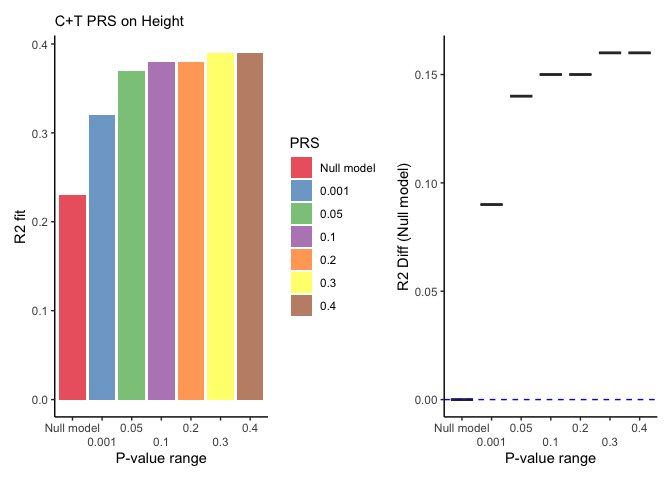

# 1 PRS Using PLINK

This tutorial allows to compute PRS using plink. Due to its bash-like
UI, the step by step process illustrates how to compute a PRS manually
via clumping and thresholding (C+T).

## 1.1 Effect size log transformation

When the effect size comes in odds ratio, a log conversion is suggested.
Then PRS can be computed as a summation of log ORs instead of products.

## 1.2 Clumping

By removing non-informational signals, it refers to the process of
preserving the most associated SNPs to the phenotype (trait).

    plink \
        --bfile EUR.QC \
        --clump-p1 1 \
        --clump-r2 0.1 \
        --clump-kb 250 \
        --clump Height.QC.Transformed \
        --clump-snp-field SNP \
        --clump-field P \
        --out EUR

Output will be $–clump: 193758 clumps formed from 489816 top variants.

We can extract the SNPs list by:

## 1.3 Generate PRS

Generate a list of p-value ranges. As noted by Choi et al: “The
threshold boundaries are inclusive. For example, for the 0.05 threshold,
we include all SNPs with P-value from 0 to 0.05, including any SNPs with
P-value equal to 0.05.”

    echo "0.001 0 0.001" > ../EUR/range_list 
    echo "0.05 0 0.05" >> ../EUR/range_list
    echo "0.1 0 0.1" >> ../EUR/range_list
    echo "0.2 0 0.2" >> ../EUR/range_list
    echo "0.3 0 0.3" >> ../EUR/range_list
    echo "0.4 0 0.4" >> ../EUR/range_list
    echo "0.5 0 0.5" >> ../EUR/range_list

## 1.4 Compute PRS

Use SNP id, allele information, and BETA (log transformed). The formula
for PRS is:

$$PRS\_{j}=\frac{\sum^{N}\_{i}S\_{i}\*G\_{ij}}{P\*M\_{j}}$$

    ./plink \
        --bfile ../EUR/EUR.QC \
        --score ../Height.QC.transformed.txt 3 4 12 header \
        --q-score-range ../EUR/range_list ../EUR/SNP.pvalue \
        --extract ../EUR/EUR.valid.snp \
        --out ../EUR

The above command and range_list will generate 7 files:

EUR.0.5.profile EUR.0.4.profile EUR.0.3.profile EUR.0.2.profile
EUR.0.1.profile EUR.0.05.profile EUR.0.001.profile

## 1.5 Accounting for Population Stratification

    # First, we need to perform prunning
    ./plink \
        --bfile ../EUR/EUR.QC \
        --indep-pairwise 200 50 0.25 \
        --out ../EUR
    # Then we calculate the first 6 PCs
    ./plink \
        --bfile ../EUR/EUR.QC \
        --extract ../EUR/EUR.prune.in \
        --pca 6 \
        --out ../EUR

    ## [1] 0.2281275

    ##   Threshold R2.diff   R2     BETA        SE            P
    ## 1        NA    0.00 0.23       NA        NA           NA
    ## 2     0.001    0.09 0.32  6667.59  853.5029 3.806105e-14
    ## 3     0.050    0.14 0.37 22741.25 2220.8554 2.557276e-22
    ## 4     0.100    0.15 0.38 29392.77 2783.7553 1.698300e-23
    ## 5     0.200    0.15 0.38 37819.97 3542.7541 6.220157e-24
    ## 6     0.300    0.16 0.39 45113.72 4123.0326 6.112680e-25

    ##   Threshold R2.diff   R2     BETA       SE           P
    ## 6       0.3    0.16 0.39 45113.72 4123.033 6.11268e-25

Which P-value threshold generates the “best-fit” PRS? 0.3

How much phenotypic variation does the “best-fit” PRS explain? 0.16

## 1.6 Visualizing PRS fit

Reader can observe the performance of including the different PRS scores
versus the null model (no PRS):

