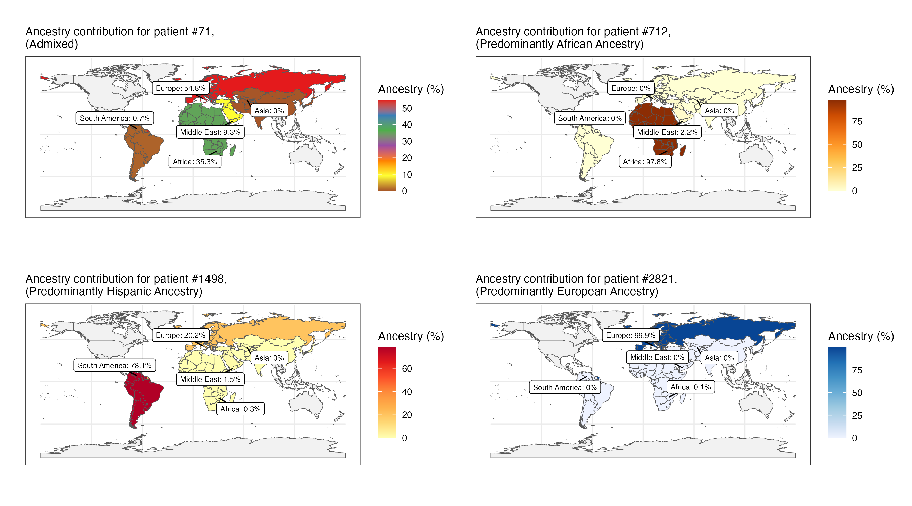

# Statistical Genetics Playground

This is my playground repo for my learning process of statistical genetics. Here, I focus on trying to complete a typical stack of stats related task. Classical tasks from the basics (Quality control, pruning) to the more complex ones (gwas, population stratification, ancestry, PRS) are part of this repository notebooks, 

## Frameworks and Tools
1. PLINK 
2. R
3. Hail (Python)

## Topics
1. Basics of Plink (URL)
2. GWAS
   * QC in Python (All of Us' example)
   * Population stratification in Hail (All of Us' example)
3. Estimating global genetic ancestry using Bigsnpr package and UK Biobank 
   * Ancestry proportions from allele frequencies only
([Part 1](https://github.com/maurosc3ner/statgenetics_playground/blob/main/Ancestry_tutorial_part1.md#2-estimating-ancestry-proportions-from-allele-frequencies-only))
   * Individual-level ancestry proportions from genotyped data ([Part 2](https://github.com/maurosc3ner/statgenetics_playground/blob/main/Ancestry_tutorial_part1.md#3-estimating-ancestry-proportions-from-genotyped-data))
   * Create your own 23 and Me ancestry map ([Part 3](https://github.com/maurosc3ner/statgenetics_playground/blob/main/Ancestry_tutorial_part1.md#4-create-your-own-23andMe-ancestry-map))
4. Polygenic risk scores (PRS)
   * QC ([Part 1](https://github.com/maurosc3ner/statgenetics_playground/blob/main/PRS_tutorial_part1.md))
   * C+T ([Part 2](https://github.com/maurosc3ner/statgenetics_playground/blob/main/PRS_tutorial_part2.md))

